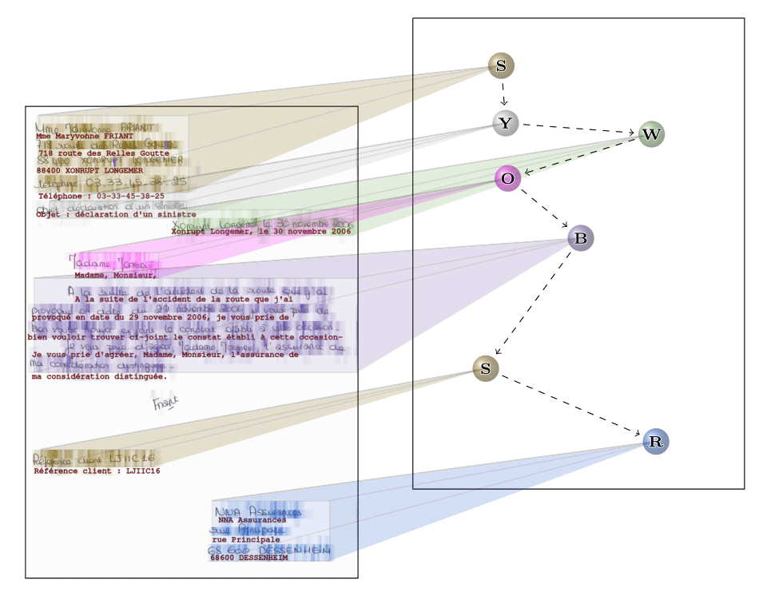

# DAN: a Segmentation-free Document Attention Network for Handwritten Document Recognition
This repository is a public implementation of the paper: "DAN: a Segmentation-free Document Attention Network for Handwritten Document Recognition".



The paper is available at COMING SOON

To discover my other works, here is my [academic page](https://factodeeplearning.github.io/).

DEMO: COMING SOON

This work focus on handwritten text and layout recognition through the use of an end-to-end segmentation-free attention-based network.
We evaluate the DAN on two public datasets: RIMES and READ 2016 at single-page and double-page levels.

We obtained the following results:

|                         | CER (%) | WER (%) | LOER (%) | mAP_cer (%) |
|:-----------------------:|---------|:-------:|:--------:|-------------|
|       RIMES (page)      | 4.55    |  11.82  |   5.02   | 92.79       |
|     READ 2016 (page)    | 3.89    |  14.45  |   6.27   | 94.10       |
| READ 2016 (double page) | 3.90    |  15.05  |   5.31   | 94.19       |


Pretrained model weights are available [here](https://git.litislab.fr/dcoquenet/dan).

Table of contents:
1. [Getting Started](#Getting-Started)
2. [Datasets](#Datasets)
3. [Training And Evaluation](#Training-and-evaluation)

## Getting Started
We used Python 3.9.1, Pytorch 1.8.2 and CUDA 10.2 for the scripts.

Clone the repository:

```
git clone https://github.com/FactoDeepLearning/DAN.git
```

Install the dependencies:

```
pip install -r requirements.txt
```


## Datasets
This section is dedicated to the datasets used in the paper: download and formatting instructions are provided 
for experiment replication purposes.

RIMES dataset at page level was distributed during the [evaluation compaign of 2009](https://ieeexplore.ieee.org/document/5277557).

READ 2016 dataset corresponds to the one used in the [ICFHR 2016 competition on handwritten text recognition](https://ieeexplore.ieee.org/document/7814136).
It can be found [here](https://zenodo.org/record/1164045#.YiINkBvjKEA)

Raw dataset files must be placed in Datasets/raw/{dataset_name} \
where dataset name is "READ 2016" or "RIMES"

## Training And Evaluation
### Step 1: Download the dataset

### Step 2: Format the dataset
```
python3 Datasets/dataset_formatters/read2016_formatter.py
python3 Datasets/dataset_formatters/rimes_formatter.py
```

### Step 3: Add any font you want as .ttf file in the folder Fonts

### Step 4 : Generate synthetic line dataset for pre-training
```
python3 OCR/line_OCR/ctc/main_syn_line.py
```
There are two lines in this script to adapt to the used dataset:
```
model.generate_syn_line_dataset("READ_2016_syn_line")
dataset_name = "READ_2016"
```

### Step 5 : Pre-training on synthetic lines
```
python3 OCR/line_OCR/ctc/main_line_ctc.py
```
There are two lines in this script to adapt to the used dataset:
```
dataset_name = "READ_2016"
"output_folder": "FCN_read_line_syn"
```
Weights and evaluation results are stored in OCR/line_OCR/ctc/outputs

### Step 6 : Training the DAN
```
python3 OCR/document_OCR/dan/main_dan.py
```
The following lines must be adapted to the dataset used and pre-training folder names:
```
dataset_name = "READ_2016"
"transfer_learning": {
    # model_name: [state_dict_name, checkpoint_path, learnable, strict]
    "encoder": ["encoder", "../../line_OCR/ctc/outputs/FCN_read_2016_line_syn/checkpoints/best.pt", True, True],
    "decoder": ["decoder", "../../line_OCR/ctc/outputs/FCN_read_2016_line_syn/best.pt", True, False],
},
```

Weights and evaluation results are stored in OCR/document_OCR/dan/outputs


### Remarks (for pre-training and training)
All hyperparameters are specified and editable in the training scripts (meaning are in comments).\
Evaluation is performed just after training ending (training is stopped when the maximum elapsed time is reached or after a maximum number of epoch as specified in the training script).\
The outputs files are split into two subfolders: "checkpoints" and "results". \
"checkpoints" contains model weights for the last trained epoch and for the epoch giving the best valid CER. \
"results" contains tensorboard log for loss and metrics as well as text file for used hyperparameters and results of evaluation.
## Citation

```bibtex
COMING SOON
```

## License

This whole project is under Cecill-C license.
